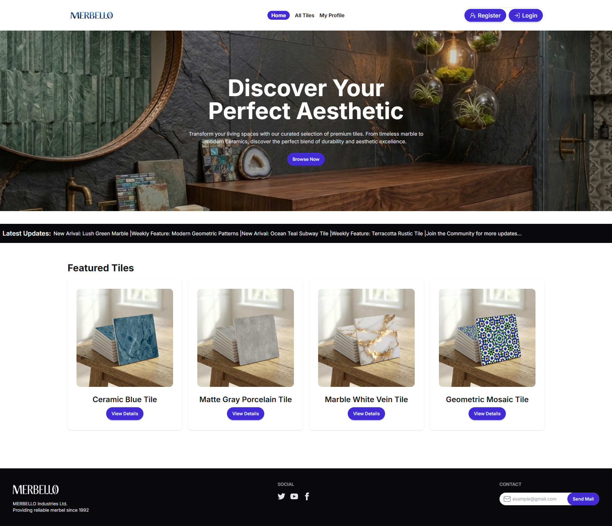

# MARBELLO

A modern and responsive tile gallery web application where users can explore aesthetic tile collections, search by title, view detailed tile information, and manage their profile securely.

## 📸 Project Screenshot



## 🔗 Live URL

https://marbello-one.vercel.app

---

## 📌 Project Purpose

Marbello is built to showcase a collection of premium aesthetic tiles in a clean and modern interface.  
Users can browse featured tiles, explore all available tiles, search specific tile designs, and view detailed information about each tile.  
The platform also includes secure authentication and profile management for a personalized experience.

---

## ✨ Key Features

- Responsive design for mobile, tablet, and desktop
- Modern and unique UI based on tile gallery concept
- Home page with banner, marquee, and featured tiles section
- All Tiles page with searchable tile gallery
- Dynamic single tile details page
- Secure authentication with email/password and Google login
- User registration with profile image support
- Protected private routes for tile details and profile
- My Profile page for viewing logged-in user information
- Update profile information (name and image)
- Loading state during data fetching
- Custom 404 Not Found page
- Route protection for authenticated users
- JSON Server for mock tile data management
- Environment variables for secure configuration

---

## 🛠️ Technologies Used

### Frontend

- Next.js (App Router)
- React
- Tailwind CSS
- DaisyUI
- HeroUI

### Backend & Database

- BetterAuth
- MongoDB
- Mongoose
- JSON Server

### Authentication

- BetterAuth Credentials Authentication
- BetterAuth Google Social Login

### Additional Libraries

- React Toastify
- Animate.css,
- React Fast Marquee
- Lucide React
- React Icons

---

## 📦 NPM Packages Used

```bash
next
react
react-dom
tailwindcss
daisyui
@heroui/react
better-auth
mongodb
mongoose
react-toastify
react-fast-marquee
lucide-react
json-server
```

## 🚀 Run This Project Locally

### Clone the Repository

```bash
git clone <your-repository-url>
cd project-name
```

### Install Dependencies

```bash
npm install
```

### Setup Environment Variables

Create a `.env.local` file in the root directory and add the following variables:

```env
MONGODB_URI=your_mongodb_uri
BETTER_AUTH_SECRET=your_secret_key
BETTER_AUTH_URL=http://localhost:3000
GOOGLE_CLIENT_ID=your_google_client_id
GOOGLE_CLIENT_SECRET=your_google_client_secret
```

## 🌐 JSON Server API

The project uses a separately deployed JSON Server API for fetching tile data.

### APIs

```bash
GET ALL TIELS: https://merbelloapi.onrender.com/tiles
GET FEATURED TILES: https://merbelloapi.onrender.com/tiles?featured=true
GET TILES BY ID: https://merbelloapi.onrender.com/tiles/:id
```

### Example API Base URL

```bash
https://merbelloapi.onrender.com
```
